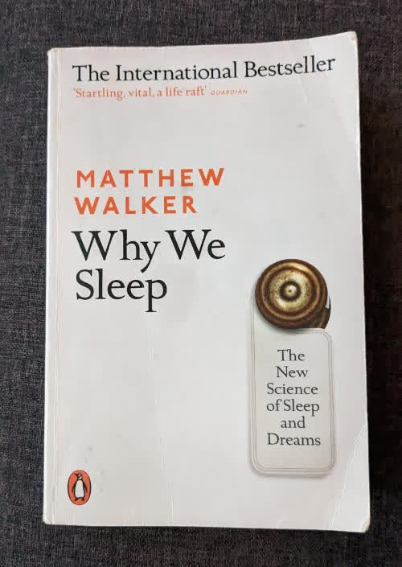

# Why We Sleep (book by Matthew Walker)

Recently I finished reading a book called "Why We Sleep" by "Matthew Walker".

It was so good that  I had to share it in a blog post.

The book first forms a question: "Why did evolution design sleep, while it does not seem to be beneficial in any evolutionary way? You can't search for food while asleep and also also can't protect yourself from predators in case of attack." If that question makes you curious too, or if you think sleeping is a waste of time, or if you don't really feel awake and energetic during the day, or if you sleep less than 7:30~8:30 hours a night, then I highly recommend this book to you. This book helps you fall in love with sleep and get excited about it.

Here I list the most interesting topics you can learn about by reading this scientific book:

- What is dreaming? Why we dream? Why do dreams feel weird? How are dreams formed?
- When did sleep form during evolution? Was it even formed during evolution? Or was it all sleep and then **wakefulness** emerged?
- How sleep differs in different animals (compared to human beings)?
- Why was sleep deprivation record banned from Guiness World Records book?
- What is Lucid dreaming? Can science prove lucid dreaming?
- Why some companies pay bonuses to their employees who sleep more (and why every company should start doing so for their own benefit)?
- What are different stages of sleep (REM and NREM) and how do they affect your overal physical and mental health?
- How coffe (caffeine in general) makes you **feel** more awake and alive? (You will love your daily coffe **less** after learning about effects of it)
- How are ADHD and sleep related?
- How are Alzheimer and sleep related?
- How are Schizophrenia and sleep related?
- Why do we have "night owls" and "morning larks" in society beside each other? (this one was a very interesting evolutionary story)
- What are the evolutionary advantages of sleep for human beings?
- Why and How different colors in light spectrum **trick** our brain into thinking it is wake time or sleep time? Specifically why and how **blue light** at night harms your sleep?
- What is the fight-or-flight response?
- How do we feel passage of time while asleep and while dreaming?
- So many people claim they can predict your future based on your dreams! But can scientists actually predict your dreams by your waking life?
- What is Circadian rhythm?
- How your sleep needs change while you grow up?
- What is the relation between sleeping, dreaming and creativity? How does sleeping help with creativty?
- How does sleeping in trees differ from sleeping on the ground? What role did this change play in our evolution? How did discovery of fire help in this regard?
- Why do eyes move while dreaming?
- What is the clinical definition of insomnia?
- How much sleep deprivation is equivalent to being legally drunk? (And you are still allowed to drive legally while this much sleep-deprived and even more) How much of car crashes relate to sleep deprivation?
- What does modern science has to say about Sigmund Freud's dream interpretations?
- Does sleep loss impact genes?
- Why we hate (and should keep hating) morning alarm clocks? (this one made me think about when was the last time I woke up naturally as a result of sufficient/adequate sleep!)
- Why and how does jet lag happen?
- The myht of "I need lesser amount of sleep": Is it really true that some people claim they need less sleep to function **normally**? (Spoiler: Hell no!)
- How does enough sleep relate to overal health, immune system, heart disease, heart attacks, etc...?
- What is microsleep?
- How does brain work in general? (in this book you will read mostly about parts that relate directly or indirectly to sleeping and dreaming)
- How does sleep help with **learning** in all the phases of life?
- Why and how does Alcohol harm fetuses and babies?
- In what situations is forgetting beneficial? And how does brain help in this regard? And what are disadvantages of forgetting? And how does sleep deprivation cause them to happen?
- What is half-brain sleeping? (a.k.a. unihemispheric sleeping)
- Why do older adults appear to need less sleep? And in what ways this wrong assumption can harm them?
- What role does sleep (and lack of sleep) play in our performance and productivity?
- Why we hated so much waking up early in the morning to go to school (And we were absolutely right about hating it)? And what was the result of some schools experimenting with changing their start time to a later time?
- What does alcohol do to sleep and dreaming?
- What roles did sleep (and the way we sleep) play in our evolution?
- What is sleepwalking and why some people have it? How does the body do it? What does the person feel when sleepwalking?

And a lots of cool tips about how you could optimize and benefit from your sleep, plus lots of interesting experiments done on humans and lab rats and spiders! and the findings.

And these are only the interesting facts I remembered about. Definitely this book was loaded with science, interesting facts and thought-provoking ideas. It helped me a lot, I feel more awake, energetic, disciplined and focused after reading this book and I'm sure you'll do too.
